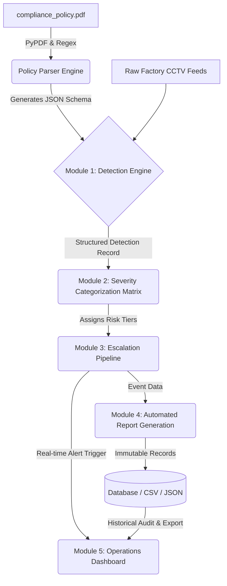
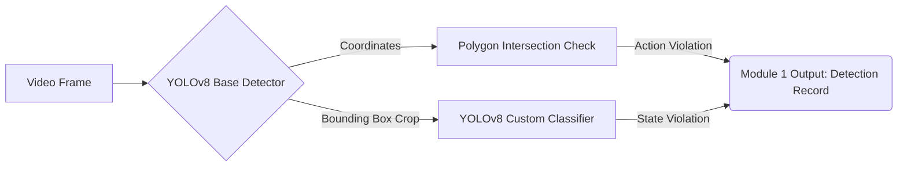

# Factory Compliance and Alert Escalation System (FCAES)

An end-to-end automated compliance system that ingests raw factory video, parses a regulatory policy document using natural language processing, dynamically drives a computer vision detection engine, and executes real-time alert workflows based on severity risk tiering.

## Architecture Overview

The system strictly adheres to the 5-module pipeline requirements:

1. **Policy Parser Engine (Pre-requisite):** A robust text parser built with `pypdf` and regex that natively ingests the `compliance_policy.pdf`. It extracts behavioral definitions, observable indicators, and linguistic hazard context into a dynamic JSON configuration schema.
2. **Module 1 (Detection Engine):** A hybrid tracking system utilizing a base pre-trained YOLOv8 model for personnel object detection and spatial polygon overlap (to handle action-based findings like walkway violations), paired with a custom fine-tuned YOLOv8 image classifier trained on Voxel51 data to identify equipment and static states.
3. **Module 2 (Severity Categorization Matrix):** Dynamically applies the hazard context extracted from the PDF schema to map events to LOW, MEDIUM, HIGH, or CRITICAL risk tiers.
4. **Module 3 (Escalation Pipeline):** Uses an asynchronous `asyncio` Pub/Sub alert queue to trigger immediate live notification flashes for HIGH/CRITICAL events, while silently logging all detections to a persistent database.
5. **Module 4 (Automated Report Generation):** Autonomously produces structured, immutable compliance records (JSON and CSV) for every detected violation, forming the facility's audit trail.
6. **Module 5 (Operations Dashboard):** A full-featured Streamlit GUI implementing 3 distinct views. It features an embedded Live Feed Monitor playing natively annotated video frames, a real-time event timeline, and a historical auditing portal for the exported audit records.

### System Pipeline



## Methodologies and Limitations

### Policy Parsing Approach
We opted against using a generative LLM in favor of a robust regex extraction pipeline via `pypdf`. Industrial compliance systems require absolute determinism and traceability; a regex pipeline guarantees that the observable visual indicators are extracted faithfully word-for-word from the authoritative policy manual, avoiding any risk of LLM hallucination or schema drift.

### Vision Pipeline Logic



### Vision Model Selection and Limitations
We utilized a hybrid approach:
- **Base YOLOv8n Object Detector**: Track `person` coordinates to check `(x, y)` locations against predefined OpenCV safe walkway polygons.
- **Custom Fine-Tuned YOLO Classifier**: We fine-tuned a custom model for 25 epochs on domain-specific industrial data to recognize safety vest compliance, panel states, and forklift loads via localized bounding box cropping. 
- *Limitations:* If multiple people are overlapping densely, or if a person is entirely occluded by equipment, the crop classifier might struggle to accurately detect safety vest compliance on heavily obscured individuals. 

### Severity Logic
The severity routing is entirely data-driven based on the text cues extracted from the policy manual. The parser hunts for headers like CRITICAL SAFETY NOTICE or WARNING. The categorization engine then evaluates these signals, mapping WARNING to MEDIUM if personnel are exposed, or LOW if it is a static state (e.g., isolated open panels). CRITICAL SAFETY NOTICE indicators always securely escalate to the CRITICAL tier, triggering the asyncio Pub/Sub queue in the Escalation Router.

## Setup and Run Instructions

This project is fully executable and requires zero manual step-by-step processing. 

### 1. Install Dependencies
```bash
pip install -r requirements.txt
```

### 2. Execute End-to-End Pipeline
Run the master orchestrator script. This script will autonomously execute all modules sequentially, starting from parsing the PDF policy, downloading a bulk batch of highly diverse camera feeds, running the computer vision detection, logging the payloads, and ultimately launching the interactive web dashboard in your browser.

```bash
python run_pipeline.py
```
